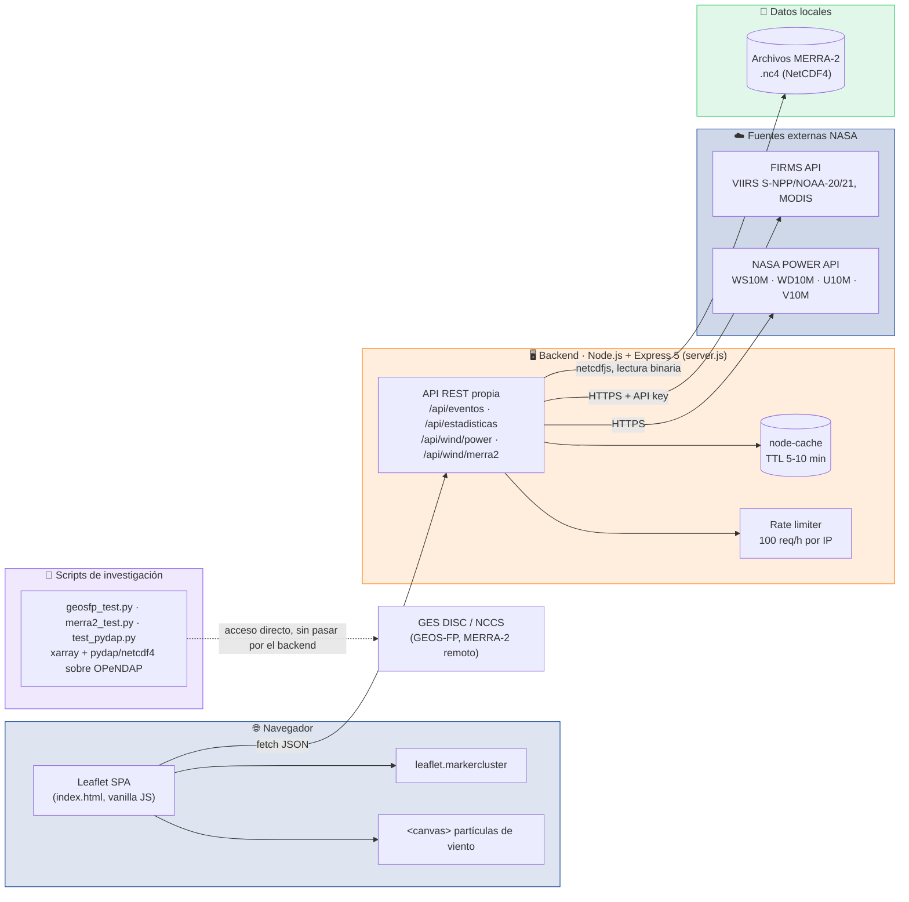
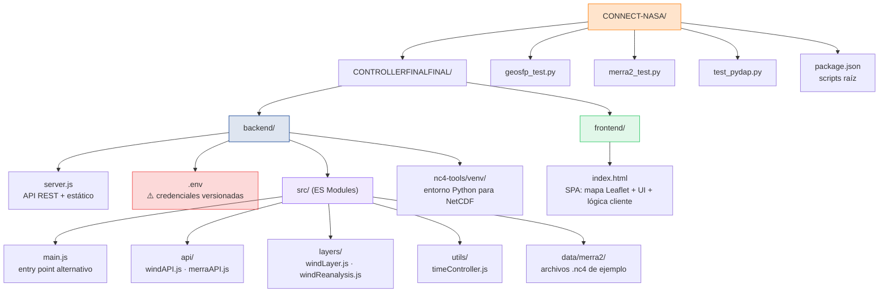
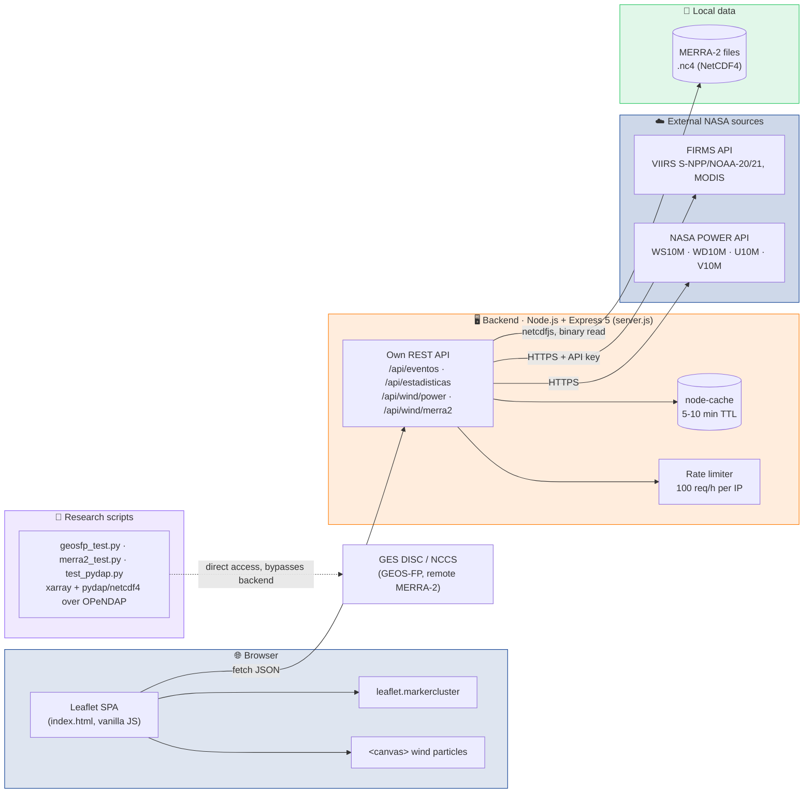
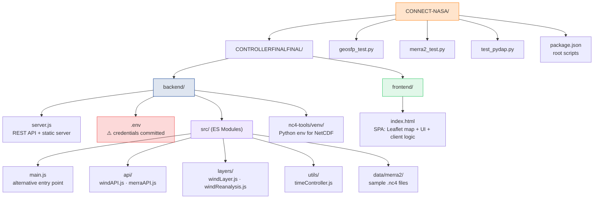

<p align="center">
  
</p>

<p align="center">
  
</p>

<p align="center">
  
  
  
  
  
  
</p>

<p align="center">
  
</p>

<p align="center">
  <a href="#español"><b>🇪🇸 Español</b></a> &nbsp;·&nbsp; <a href="#english"><b>🇬🇧 English</b></a>
</p>

---

<a name="español"></a>
## 🇪🇸 Español

### 📑 Tabla de contenidos

- [¿Qué es esto?](#qué-es-esto)
- [Arquitectura](#arquitectura)
- [Secuencia de una consulta](#secuencia-de-una-consulta)
- [Características principales](#características-principales)
- [Stack tecnológico](#stack-tecnológico)
- [Estructura del proyecto](#estructura-del-proyecto)
- [Estado del proyecto y roadmap](#estado-del-proyecto-y-roadmap)
- [Licencia](#licencia)
- [Autor](#autor)

---

### ¿Qué es esto?

**CONNECT-NASA** es una aplicación web full-stack que cruza varias fuentes de datos abiertos de la NASA para poner, en un único mapa interactivo, los **focos de calor / incendios activos** detectados por la constelación **FIRMS** (VIIRS y MODIS) junto con el **viento a 10 metros de altura** obtenido de **NASA POWER** y de reanálisis **MERRA-2**, con foco geográfico en **Bolivia** y sus nueve departamentos.

La idea detrás del proyecto es simple pero potente: los incendios forestales no se entienden solos. Un foco de calor con viento fuerte y sostenido en una dirección se comporta de forma completamente distinta a uno en calma, y esa correlación es justamente lo que la mayoría de los visores públicos de FIRMS no muestran. CONNECT-NASA junta ambas señales — fuego y viento — en la misma vista, calcula un **nivel de riesgo compuesto** por foco y deja que el usuario compare la fuente de viento en tiempo real (POWER) contra un reanálisis histórico local (MERRA-2) sin salir del navegador.

El nombre del repositorio, el uso intensivo de APIs oficiales de la NASA (FIRMS, POWER, GES DISC/MERRA-2, GEOS-FP vía OPeNDAP) y el ritmo de desarrollo sugieren un origen ligado a un desafío o hackathon de datos abiertos, aunque el repo en su estado actual no documenta explícitamente el evento, equipo o categoría en la que participó.

**¿Para quién es?** Investigadores, defensas civiles, ONGs ambientales o cualquier persona que necesite una vista rápida y visual de la actividad de incendios y viento en territorio boliviano, sin depender de herramientas de escritorio pesadas (GIS) para un vistazo operativo diario.

> ⚠️ **Nota de seguridad**: el repositorio tiene versionado `CONTROLLERFINALFINAL/backend/.env`, que en el historial de Git contiene una `FIRMS_MAP_KEY` real. Como el repositorio es **público**, esa clave debe considerarse **expuesta y comprometida**: se recomienda rotarla en el panel de FIRMS y eliminar el archivo del control de versiones (agregando `**/.env` al `.gitignore`) lo antes posible. Este README no reproduce ningún valor real de esa clave.

### Arquitectura

CONNECT-NASA sigue un patrón clásico de **backend agregador**: un único servidor Express concentra el acceso a tres fuentes de datos de naturaleza muy distinta (una API REST de terceros, una API meteorológica de la NASA y archivos binarios locales) y expone una API propia, simple y cacheada, que consume un frontend Leaflet sin build step.



> El servidor expone además un **módulo alternativo de viento** en `CONTROLLERFINALFINAL/backend/src/` (ES Modules: `main.js`, `windAPI.js`, `merraAPI.js`, `windLayer.js`, `windReanalysis.js`), una implementación paralela/experimental que apunta a NASA POWER y a MERRA-2 vía Earthdata, pensada para probarse por separado y todavía no unificada con la lógica integrada en `server.js`.

### Secuencia de una consulta

Así se resuelve, de punta a punta, una carga típica del mapa: el usuario abre (o refresca) la vista, el backend consulta en paralelo las tres fuentes de datos, agrega estadísticas y responde al frontend, que renderiza marcadores agrupados y partículas de viento animadas.

```mermaid
sequenceDiagram
    actor User as Usuario
    participant FE as Frontend (Leaflet)
    participant BE as Backend (Express)
    participant Cache as node-cache
    participant FIRMS as FIRMS API
    participant POWER as NASA POWER API
    participant NC4 as MERRA-2 (.nc4 local)

    User->>FE: Abre el mapa / cambia filtro (fuente, región, días)
    FE->>BE: GET /api/eventos?source=...&region=...&days=...
    BE->>Cache: ¿hit en cache? (TTL 5 min)
    alt cache miss
        BE->>FIRMS: Solicita focos de calor (API key)
        FIRMS-->>BE: CSV/JSON de detecciones VIIRS/MODIS
        BE->>BE: Calcula riesgo compuesto, categoriza evento,<br/>convierte a hora local, deduplica
        BE->>Cache: Guarda resultado
    end
    BE-->>FE: JSON de eventos de incendio

    FE->>BE: GET /api/estadisticas?days=...&region=...
    BE-->>FE: Totales, promedios, tendencia 24h

    par Capa de viento en vivo
        FE->>BE: GET /api/wind/power?lat=...&lon=...
        BE->>POWER: temporal/hourly o daily
        POWER-->>BE: WS10M, WD10M, U10M, V10M
        BE-->>FE: Serie de viento (POWER)
    and Capa de viento por reanálisis
        FE->>BE: GET /api/wind/merra2?lat=...&lon=...
        BE->>NC4: Lee y parsea archivo .nc4 (netcdfjs)
        NC4-->>BE: Grillas de viento MERRA-2
        BE-->>FE: Serie de viento (MERRA-2)
    end

    FE->>FE: Renderiza clusters de focos (leaflet.markercluster)<br/>y anima partículas de viento en &lt;canvas&gt;
    FE-->>User: Mapa interactivo actualizado
```

### Características principales

**🔥 Incendios activos (FIRMS)**
- Capa de focos de calor con agrupamiento de marcadores (`leaflet.markercluster`) que se expande al hacer zoom.
- Colores y radios de marcador según el **nivel de confianza** de la detección (nominal, baja, media, alta, muy alta).
- **Nivel de riesgo compuesto** calculado a partir de confianza, brillo (`bright_ti4`/`bright_ti5`) y Fire Radiative Power (FRP).
- Categorización automática del evento (foco de calor, incendio activo pequeño/moderado/grande) según FRP y área de píxel.
- Selección de fuente satelital: VIIRS S-NPP, VIIRS NOAA-20, VIIRS NOAA-21, MODIS Terra & Aqua, o todas combinadas (`ALL`) con deduplicación de eventos.
- Filtro por región: Bolivia completa, por departamento (Santa Cruz, La Paz, Beni, Pando, Tarija, Cochabamba, Oruro, Potosí) o un `bbox` personalizado.
- Conversión de horario UTC a horario local de Bolivia y popups con detalle completo por foco (satélite, instrumento, temperatura estimada, día/noche, etc.).

**🌬️ Viento y clima**
- **Viento en tiempo real (NASA POWER)**: consulta `temporal/hourly` o `daily` de POWER para un punto (lat/lon), devolviendo series de `WS10M`, `WD10M`, `U10M`, `V10M`.
- **Viento por reanálisis (MERRA-2 local)**: lectura directa de archivos NetCDF4 (`.nc4`) mediante `netcdfjs`, sin necesidad de conexión a internet para esta capa.
- **Animación de partículas de viento** sobre un `<canvas>` superpuesto al mapa, con reproducción (play/pausa), velocidad ajustable y selector de fuente (POWER vs MERRA-2).

**📊 Estadísticas agregadas**
- Endpoint `/api/estadisticas`: totales por confianza, por satélite, por hora del día, por día, por severidad.
- Promedios de confianza y FRP, área total afectada.
- Tendencia (aumento/disminución) respecto a las 24 h anteriores.
- Focos más recientes y de mayor confianza.

**⚙️ Infraestructura de API**
- **Cache en memoria** (`node-cache`) para reducir llamadas repetidas a las APIs externas (TTL de 5 min para eventos, 10 min para estadísticas).
- **Rate limiting básico** por IP (100 solicitudes/hora) para proteger el uso de la API key de FIRMS.
- Endpoint de **validación de API key** (`/api/validar`) y de **salud** (`/api/health`) para diagnóstico rápido.
- Endpoints auxiliares: `/api/fuentes` (fuentes satelitales disponibles) y `/api/regiones` (departamentos/bbox configurados).

**🐍 Scripts de investigación en Python**
- `geosfp_test.py`, `merra2_test.py`, `test_pydap.py`: prueban el acceso vía **OPeNDAP** a datasets **GEOS-FP** y **MERRA-2** directamente desde los servidores de la NASA (GES DISC / NCCS), usando `xarray` con los motores `netcdf4` y `pydap`.
- Son utilidades de investigación **independientes del servidor Node**, pensadas para explorar datos antes (o en paralelo) de integrarlos al backend.

### Stack tecnológico

| Capa | Tecnología | Rol |
|---|---|---|
| 🖥️ Backend | **Node.js** (v22.x) + **Express 5** | Servidor HTTP y API REST agregadora |
| 🌐 Cliente HTTP | node-fetch 2.x | Llamadas a las APIs de FIRMS y NASA POWER |
| 📦 Parsing NetCDF | netcdfjs 0.7.x | Lectura de archivos MERRA-2 (`.nc4`) en JS puro |
| ⚡ Cache | node-cache | Cache en memoria con TTL para eventos y estadísticas |
| 🔐 Middleware | cors, dotenv | CORS de desarrollo y carga de variables de entorno |
| 🎨 Frontend | HTML5 + CSS3 + **JavaScript vanilla** | SPA de un solo `index.html`, sin framework ni bundler |
| 🗺️ Mapas | **Leaflet 1.9.4** + Leaflet.markercluster 1.5.3 | Motor de mapas y agrupamiento de marcadores |
| 🖼️ Tiles | OpenStreetMap, Esri World Imagery, CARTO (dark/light) | Capas base del mapa |
| 🌬️ Viento (módulo alt.) | ES Modules en `backend/src/` | Implementación paralela orientada a POWER + MERRA-2 vía Earthdata |
| 🐍 Investigación | Python + xarray + pydap/netCDF4 | Exploración OPeNDAP de GEOS-FP y MERRA-2 |
| 🛠️ Orquestación | concurrently + serve | Modo desarrollo (backend + estático del frontend) |

**Fuentes de datos NASA utilizadas:**

| Fuente | Qué provee | Enlace |
|---|---|---|
| **FIRMS** | Incendios activos vía VIIRS/MODIS | [firms.modaps.eosdis.nasa.gov](https://firms.modaps.eosdis.nasa.gov/) |
| **NASA POWER** | Viento a 10 m en tiempo casi real | [power.larc.nasa.gov](https://power.larc.nasa.gov/) |
| **MERRA-2** | Reanálisis atmosférico (GES DISC, OPeNDAP/Earthdata) | [gmao.gsfc.nasa.gov/reanalysis/MERRA-2](https://gmao.gsfc.nasa.gov/reanalysis/MERRA-2/) |
| **GEOS-FP** | Pronósticos operacionales (script exploratorio) | [gmao.gsfc.nasa.gov/GMAO_products](https://gmao.gsfc.nasa.gov/GMAO_products/NRT_products.php) |

### Estructura del proyecto



- **`CONTROLLERFINALFINAL/backend`**: corazón de la aplicación. Expone la API REST que consulta FIRMS y NASA POWER, sirve el frontend estático y lee archivos NetCDF locales para la capa MERRA-2.
- **`CONTROLLERFINALFINAL/frontend`**: interfaz de usuario, un único `index.html` autocontenido con Leaflet y JavaScript vanilla que consume la API del backend.
- **Raíz del repo**: scripts de Python independientes usados para explorar/depurar el acceso a datasets NASA vía OPeNDAP; no forman parte del flujo de ejecución del servidor Node.
- Los archivos `.nc4` están configurados para **Git LFS** (`.gitattributes`) e ignorados en `.gitignore` por su tamaño.

### Estado del proyecto y roadmap

Este es un proyecto **funcional en etapa de prototipo/demo**: cubre el flujo completo (ingestión de datos NASA → API propia → visualización interactiva), pero conserva señales típicas de un desarrollo rápido tipo hackathon.

- [x] Mapa interactivo con capas de incendios (FIRMS) y viento (POWER + MERRA-2) funcionando end-to-end.
- [x] Clustering de marcadores, cálculo de riesgo compuesto y categorización automática de eventos.
- [x] Animación de partículas de viento con selector de fuente y control de velocidad.
- [x] Estadísticas agregadas, cache con TTL y rate limiting básico por IP.
- [x] Scripts exploratorios de acceso OPeNDAP a GEOS-FP y MERRA-2.
- [ ] Unificar las dos implementaciones de la capa de viento (`server.js` vs. módulo ES Modules en `src/`).
- [ ] Generalizar el endpoint `/api/wind/merra2`, que hoy asume un orden fijo de dimensiones `[time, lat, lon]` sin manejo genérico de metadatos NetCDF.
- [ ] Retirar `.env` del control de versiones y rotar cualquier credencial expuesta.
- [ ] Sumar una suite de tests automatizados (hoy no existe ninguna).
- [ ] Agregar un `requirements.txt` para los scripts de Python.
- [ ] Ampliar la cobertura geográfica más allá de Bolivia.
- [ ] Declarar una licencia explícita para el repositorio.

### Licencia

El repositorio **no incluye un archivo `LICENSE`**. Por lo tanto, y siguiendo el comportamiento por defecto de GitHub, todos los derechos están reservados por el autor — **no se otorga permiso explícito de uso, copia, modificación o distribución** salvo que el propietario indique lo contrario.

### Autor

<p align="left">
  <a href="https://github.com/jackson1939"></a>
</p>

---

<a name="english"></a>
## 🇬🇧 English

### 📑 Table of contents

- [What is this?](#what-is-this)
- [Architecture](#architecture)
- [Anatomy of a query](#anatomy-of-a-query)
- [Key features](#key-features)
- [Tech stack](#tech-stack)
- [Project structure](#project-structure)
- [Project status and roadmap](#project-status-and-roadmap)
- [License](#license)
- [Author](#author)

---

### What is this?

**CONNECT-NASA** is a full-stack web application that combines several open NASA data sources to put, on a single interactive map, **active fire hotspots** detected by the **FIRMS** satellite constellation (VIIRS and MODIS) together with **10-meter wind data** from **NASA POWER** and **MERRA-2** reanalysis, geographically focused on **Bolivia** and its nine departments.

The idea behind the project is simple but powerful: wildfires don't tell the whole story on their own. A hotspot with strong, sustained wind in one direction behaves very differently from one in calm conditions, and that correlation is exactly what most public FIRMS viewers fail to show. CONNECT-NASA brings both signals — fire and wind — into the same view, computes a **composite risk score** per hotspot, and lets the user compare real-time wind (POWER) against a local historical reanalysis (MERRA-2) without ever leaving the browser.

The repository's name, its heavy use of official NASA APIs (FIRMS, POWER, GES DISC/MERRA-2, GEOS-FP via OPeNDAP) and its development pace suggest an origin tied to a NASA open-data challenge or hackathon, although the repository in its current state does not explicitly document the event, team, or category it was submitted under.

**Who is it for?** Researchers, civil defense agencies, environmental NGOs, or anyone who needs a quick, visual snapshot of fire activity and wind in Bolivian territory without relying on heavy desktop GIS tools for day-to-day operational awareness.

> ⚠️ **Security note**: the repository has `CONTROLLERFINALFINAL/backend/.env` committed to version control, and it contains a real `FIRMS_MAP_KEY` in the Git history. Since this repository is **public**, that key must be treated as **exposed and compromised**: it should be rotated in the FIRMS panel and the file should be removed from version control (adding `**/.env` to `.gitignore`) as soon as possible. This README does not reproduce any real value of that key.

### Architecture

CONNECT-NASA follows a classic **aggregator backend** pattern: a single Express server concentrates access to three very different data sources (a third-party REST API, a NASA weather API, and local binary files) and exposes its own simple, cached API, consumed by a bundler-free Leaflet frontend.



> The server also exposes an **alternative wind module** under `CONTROLLERFINALFINAL/backend/src/` (ES Modules: `main.js`, `windAPI.js`, `merraAPI.js`, `windLayer.js`, `windReanalysis.js`), a parallel/experimental implementation targeting NASA POWER and MERRA-2 via Earthdata, meant to be tested separately and not yet unified with the logic integrated into `server.js`.

### Anatomy of a query

Here's how a typical map load resolves end-to-end: the user opens (or refreshes) the view, the backend queries all three data sources, aggregates statistics, and responds to the frontend, which renders clustered markers and animated wind particles.

```mermaid
sequenceDiagram
    actor User
    participant FE as Frontend (Leaflet)
    participant BE as Backend (Express)
    participant Cache as node-cache
    participant FIRMS as FIRMS API
    participant POWER as NASA POWER API
    participant NC4 as MERRA-2 (local .nc4)

    User->>FE: Opens the map / changes filter (source, region, days)
    FE->>BE: GET /api/eventos?source=...&region=...&days=...
    BE->>Cache: cache hit? (5 min TTL)
    alt cache miss
        BE->>FIRMS: Requests hotspots (API key)
        FIRMS-->>BE: CSV/JSON of VIIRS/MODIS detections
        BE->>BE: Computes composite risk, categorizes event,<br/>converts to local time, deduplicates
        BE->>Cache: Stores result
    end
    BE-->>FE: Fire event JSON

    FE->>BE: GET /api/estadisticas?days=...&region=...
    BE-->>FE: Totals, averages, 24h trend

    par Live wind layer
        FE->>BE: GET /api/wind/power?lat=...&lon=...
        BE->>POWER: temporal/hourly or daily
        POWER-->>BE: WS10M, WD10M, U10M, V10M
        BE-->>FE: Wind series (POWER)
    and Reanalysis wind layer
        FE->>BE: GET /api/wind/merra2?lat=...&lon=...
        BE->>NC4: Reads and parses .nc4 file (netcdfjs)
        NC4-->>BE: MERRA-2 wind grids
        BE-->>FE: Wind series (MERRA-2)
    end

    FE->>FE: Renders hotspot clusters (leaflet.markercluster)<br/>and animates wind particles on &lt;canvas&gt;
    FE-->>User: Updated interactive map
```

### Key features

**🔥 Active fires (FIRMS)**
- Hotspot layer with marker clustering (`leaflet.markercluster`) that expands on zoom.
- Marker colors and sizes based on detection **confidence level** (nominal, low, medium, high, very high).
- **Composite risk score** computed from confidence, brightness (`bright_ti4`/`bright_ti5`) and Fire Radiative Power (FRP).
- Automatic event categorization (heat source, small/moderate/large active fire) based on FRP and pixel area.
- Satellite source selection: VIIRS S-NPP, VIIRS NOAA-20, VIIRS NOAA-21, MODIS Terra & Aqua, or all combined (`ALL`) with event deduplication.
- Region filtering: all of Bolivia, a specific department (Santa Cruz, La Paz, Beni, Pando, Tarija, Cochabamba, Oruro, Potosí), or a custom `bbox`.
- UTC-to-Bolivia local time conversion and popups with full detail per hotspot (satellite, instrument, estimated temperature, day/night flag, etc.).

**🌬️ Wind and weather**
- **Real-time wind (NASA POWER)**: queries POWER's `temporal/hourly` or `daily` endpoint for a given point (lat/lon), returning `WS10M`, `WD10M`, `U10M`, `V10M` series.
- **Reanalysis wind (local MERRA-2)**: direct parsing of local NetCDF4 (`.nc4`) files via `netcdfjs`, requiring no internet connection for this layer.
- **Animated wind particles** rendered on a `<canvas>` overlaid on the map, with playback controls (play/pause), adjustable speed, and a source selector (POWER vs. MERRA-2).

**📊 Aggregated statistics**
- `/api/estadisticas` endpoint: totals by confidence, by satellite, by hour of day, by day, by severity.
- Average confidence/FRP, total affected area.
- 24h trend (increasing/decreasing).
- Most recent and highest-confidence hotspots.

**⚙️ API infrastructure**
- **In-memory caching** (`node-cache`) to reduce repeated calls to external APIs (5-minute TTL for events, 10-minute TTL for statistics).
- **Basic per-IP rate limiting** (100 requests/hour) to protect FIRMS API key usage.
- **API key validation endpoint** (`/api/validar`) and **health check endpoint** (`/api/health`) for quick diagnostics.
- Helper endpoints: `/api/fuentes` (available satellite sources) and `/api/regiones` (configured departments/bboxes).

**🐍 Python research scripts**
- `geosfp_test.py`, `merra2_test.py`, `test_pydap.py`: test **OPeNDAP** access to **GEOS-FP** and **MERRA-2** datasets directly from NASA servers (GES DISC / NCCS), using `xarray` with the `netcdf4` and `pydap` engines.
- These are research utilities **independent of the Node server**, useful for exploring data before (or alongside) integrating it into the backend.

### Tech stack

| Layer | Technology | Role |
|---|---|---|
| 🖥️ Backend | **Node.js** (v22.x) + **Express 5** | HTTP server and aggregator REST API |
| 🌐 HTTP client | node-fetch 2.x | Calls to FIRMS and NASA POWER APIs |
| 📦 NetCDF parsing | netcdfjs 0.7.x | Reads MERRA-2 (`.nc4`) files in pure JS |
| ⚡ Cache | node-cache | In-memory TTL cache for events and statistics |
| 🔐 Middleware | cors, dotenv | Local-dev CORS and environment variable loading |
| 🎨 Frontend | HTML5 + CSS3 + **vanilla JavaScript** | Single `index.html` SPA, no framework or bundler |
| 🗺️ Maps | **Leaflet 1.9.4** + Leaflet.markercluster 1.5.3 | Map engine and marker clustering |
| 🖼️ Tiles | OpenStreetMap, Esri World Imagery, CARTO (dark/light) | Map base layers |
| 🌬️ Wind (alt. module) | ES Modules under `backend/src/` | Parallel implementation targeting POWER + MERRA-2 via Earthdata |
| 🐍 Research | Python + xarray + pydap/netCDF4 | OPeNDAP exploration of GEOS-FP and MERRA-2 |
| 🛠️ Orchestration | concurrently + serve | Dev mode (backend + static frontend) |

**NASA data sources used:**

| Source | What it provides | Link |
|---|---|---|
| **FIRMS** | Active fires via VIIRS/MODIS | [firms.modaps.eosdis.nasa.gov](https://firms.modaps.eosdis.nasa.gov/) |
| **NASA POWER** | Near-real-time 10m wind | [power.larc.nasa.gov](https://power.larc.nasa.gov/) |
| **MERRA-2** | Atmospheric reanalysis (GES DISC, OPeNDAP/Earthdata) | [gmao.gsfc.nasa.gov/reanalysis/MERRA-2](https://gmao.gsfc.nasa.gov/reanalysis/MERRA-2/) |
| **GEOS-FP** | Operational forecasts (exploratory script) | [gmao.gsfc.nasa.gov/GMAO_products](https://gmao.gsfc.nasa.gov/GMAO_products/NRT_products.php) |

### Project structure



- **`CONTROLLERFINALFINAL/backend`**: the heart of the application. Exposes the REST API that queries FIRMS and NASA POWER, serves the static frontend, and reads local NetCDF files for the MERRA-2 layer.
- **`CONTROLLERFINALFINAL/frontend`**: the user interface, a single self-contained `index.html` with Leaflet and vanilla JavaScript that consumes the backend API.
- **Repo root**: standalone Python scripts used to explore/debug OPeNDAP access to NASA datasets; not part of the Node server's runtime flow.
- `.nc4` files are configured for **Git LFS** (`.gitattributes`) and ignored via `.gitignore` due to their size.

### Project status and roadmap

This is a **functional prototype/demo-stage project**: it covers the full flow (NASA data ingestion → custom API → interactive visualization), but retains typical signs of rapid, hackathon-style development.

- [x] Interactive map with fire (FIRMS) and wind (POWER + MERRA-2) layers working end-to-end.
- [x] Marker clustering, composite risk scoring, and automatic event categorization.
- [x] Animated wind particles with source selector and speed control.
- [x] Aggregated statistics, TTL cache, and basic per-IP rate limiting.
- [x] Exploratory OPeNDAP access scripts for GEOS-FP and MERRA-2.
- [ ] Unify the two wind layer implementations (`server.js` vs. the ES Modules module under `src/`).
- [ ] Generalize the `/api/wind/merra2` endpoint, which currently assumes a fixed `[time, lat, lon]` dimension order without generic NetCDF metadata handling.
- [ ] Remove `.env` from version control and rotate any exposed credentials.
- [ ] Add an automated test suite (none exists today).
- [ ] Add a `requirements.txt` for the Python scripts.
- [ ] Extend geographic coverage beyond Bolivia.
- [ ] Declare an explicit license for the repository.

### License

The repository **does not include a `LICENSE` file**. Therefore, following GitHub's default behavior, all rights are reserved by the author — **no explicit permission is granted to use, copy, modify, or distribute** this code unless the owner states otherwise.

### Author

<p align="left">
  <a href="https://github.com/jackson1939"></a>
</p>

<p align="center">
  
</p>
